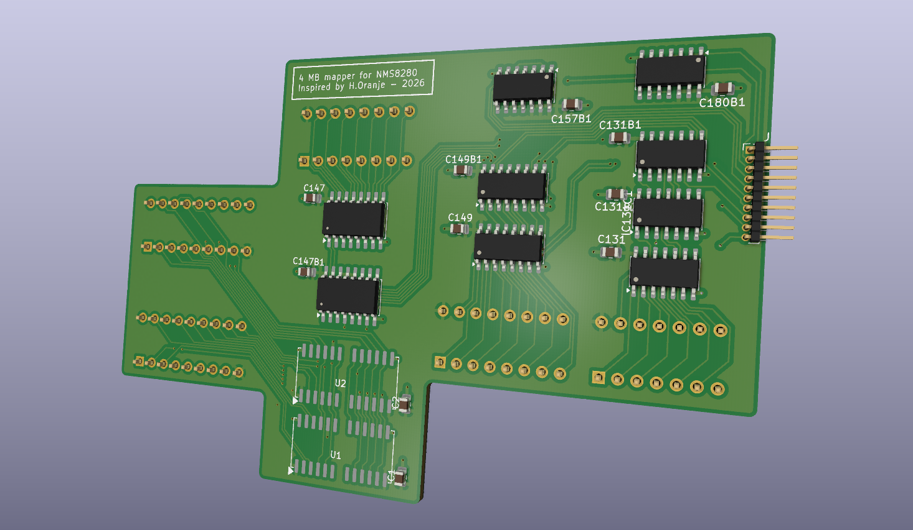

# Philips NMS8280 MSX2 4MB memory mapper

First and foremost:

> **WARNING:** Do not use or build this board until the correct measurements
> have been completed on the prototype. This design has not yet been verified
> for production use. A prototype has been ordered from JLCPCB. Precise measurements
> will be taken soon, mechanically as well as electrically.

In here you will find my PCB design, based on the original design by Hans Oranje. See reference documents below. 

My goal was to create a PCB to get rid of most of the wiring described in the original paper.

Why design a yet another PCB, while there are so many other solutions? 

- This design replaces the stock memory, so it doesn't occupy a (expanded) slot. It just keeps the memory at slot 3.2
- No piggybacking IC's on the original IC's. The piggybacking still occurs, but neatly on the PCB
- No gazzilion wires, creating spaghetti
- Reverting back to stock should be easy
- Profile kept as low as possible to fit

## BOM

<a href="./bom/ibom.html" target="_blank" rel="noopener noreferrer">BOM</a>

## Manual

wip

## Reference and documentation

- [Hans Oranje paper in Dutch](./DOC/4mbnms8280.pdf)
- [HY5117404B](./DOC/HY5117404B.pdf)
- [SN74LS00](./DOC/SN74LS00.pdf)
- [SN74LS08](./DOC/SN74LS08.pdf)
- [SN74LS125](./DOC/SN74LS125.pdf)
- [SN74LS157](./DOC/SN74LS157.pdf)
- [SN74LS670](./DOC/SN74LS670.pdf)

The RAM used by this design is HY5117404B, represented by the custom
`HYB5117400BJ` symbol in the schematic. The `1464` custom symbol has no
manufacturer part number in the schematic, so no unambiguous datasheet can be
assigned to it.
